<div align="center">

**English** | **[简体中文](./README.md)**


# ✨ Lumina Note

**Local-First · AI-Powered · Modern Knowledge Base**

Build your second brain with an Agent-powered Markdown note-taking app.

[](https://tauri.app/)
[](https://react.dev/)
[](https://www.rust-lang.org/)
[](LICENSE)

[Quick Start](#-quick-start) • [Features](#-core-features) • [Architecture](#-tech-architecture) • [Contributing](#)

<br/>


</div>

<br/>

---

## 🎯 Core Features

Lumina Note is not just an editor—it's a knowledge production environment powered by LLM capabilities.

### 📝 Immersive Editing Experience
* **Multi-mode Switching**: Seamlessly switch between **Source / Live Preview / Reading** modes.
* **Bidirectional Links**: Build a networked knowledge graph using `[[WikiLinks]]`.
* **Professional Typesetting**: Native support for LaTeX math, Mermaid diagrams, and Obsidian-style `> [!info]` callouts.
* **Syntax Highlighting**: Powered by CodeMirror 6, supporting hundreds of programming languages.

### 🕸️ Knowledge Graph
High-performance visualization engine built on Canvas, intuitively displaying connections between notes.

| Feature | Description |
| :--- | :--- |
| **Folder Hierarchy** | Folders displayed as nodes (spiked ball style) with arrow connections for parent-child relationships |
| **Color Zones** | Auto-assigned colors by folder, child nodes inherit parent folder colors |
| **Bidirectional Links** | `[[WikiLinks]]` automatically parsed as connections between nodes |
| **Isolated View** | Right-click any node to view it and its direct connections in a new tab |
| **Physics Engine** | Adjustable repulsion, elasticity, and centripetal force; supports node dragging and canvas zoom |

### 🤖 AI Agent System
| Module | Description |
| :--- | :--- |
| **Agent Mode** | Understands intent and automatically executes complex task chains like reading, editing, and searching notes. |
| **AI Floating Ball** | An always-available assistant, draggable, never interrupts your flow. |
| **Voice Input** | Voice-to-text based on Web Speech API, with streaming display, auto-stop, and recording animation. |
| **Diff Preview** | Provides a Diff comparison view before AI modifications—you decide whether to apply. |
| **RAG Semantic Search** | Built-in SQLite vector database for semantic-based retrieval of your local knowledge base. |

### 🎬 Bilibili Video Notes
Take notes while watching videos with precise timestamp recording via danmaku sync.

| Feature | Description |
| :--- | :--- |
| **Embedded Playback** | Play Bilibili videos directly in-app, supports login and posting danmaku |
| **Danmaku Sync** | Send prefixed danmaku (e.g., `#note content`) to sync as timestamped notes |
| **Time Jump** | Click note timestamps to jump to the corresponding video position (no refresh needed) |
| **Auto Save** | Notes auto-save as Markdown files, automatically loaded when reopening the same video |

> 💡 Tech Highlight: Uses Tauri 2.0 multi-WebView feature for true embedded playback, bypassing iframe CSRF limitations

### 🎨 Theme System
| Feature | Description |
| :--- | :--- |
| **11 Official Themes** | Default/Ocean/Forest/Lavender/Rose/Sunset/Mint/Indigo/Latte/Aurora/Minimal |
| **Light/Dark Auto-adapt** | Each theme automatically adapts to light/dark mode |
| **Markdown Colors** | Themes affect 17 elements including headings/links/code blocks/quotes |
| **Custom Title Bar** | Changes color with theme, supports dragging and window controls |

### 🔌 Multi-Model Ecosystem
Connect to mainstream LLM providers and freely switch models:
> `Anthropic` · `OpenAI` · `Gemini` · `DeepSeek` · `Moonshot` · `Groq` · `Ollama (Local)`

---

## 🛠️ Tech Architecture

This project uses a **Rust + React** frontend-backend separation architecture, bridged by Tauri v2 for native capabilities.

```mermaid
graph TD
    subgraph Frontend["🖥️ Frontend (React 18 + TS)"]
        UI[Components & UI]
        Editor[CodeMirror Editor]
        Agent[AI Agent System]
        Store[Zustand Store]
    end

    subgraph Backend["🦀 Backend (Rust + Tauri v2)"]
        Tauri[Tauri Commands]
        FS[File System Ops]
        Vector[SQLite Vector DB]
        LLM[LLM Client]
    end

    UI --> Store
    Editor --> Store
    Agent --> LLM
    Agent --> Tauri
    Tauri --> FS
    Tauri --> Vector
```



### Tech Stack

* **Core**: [Tauri v2](https://v2.tauri.app/)
* **UI**: React 18, Tailwind CSS, Radix UI
* **Editor**: CodeMirror 6
* **State**: Zustand
* **Database**: SQLite (Vector Extension)
* **Languages**: TypeScript, Rust

---

## 🚀 Quick Start

### Prerequisites
Before starting, ensure your environment has:
* **Node.js**: 18.0+
* **Rust**: 1.70+
* **Package Manager**: npm or pnpm

### Installation Steps

1.  **Clone the repository**
    ```bash
    git clone https://github.com/blueberrycongee/Lumina-Note.git
    cd Lumina-Note
    ```

2.  **Install dependencies**
    ```bash
    npm install
    # or pnpm install
    ```

3.  **Run in development mode**
    ```bash
    npm run tauri dev
    ```

4.  **Build for production**
    ```bash
    npm run tauri build
    ```

---

## ⌨️ Keyboard Shortcuts

| Shortcut | Action |
| :--- | :--- |
| `Ctrl/Cmd + P` | **Command Palette** (like VSCode) |
| `Ctrl/Cmd + S` | Save current file |
| `Ctrl/Cmd + N` | Create new note |
| `Ctrl/Cmd + Shift + F` | Global semantic/keyword search |
| `Ctrl/Cmd + B` | Toggle sidebar visibility |

---

## 🗺️ Roadmap

- [x] **Core**: Multi LLM Provider support (8 providers)
- [x] **Agent**: AI Agent system with tool-calling capabilities
- [x] **RAG**: Local vector database and semantic retrieval
- [x] **UI**: AI floating ball with streaming response interaction
- [x] **Video**: Bilibili video notes (embedded WebView + danmaku sync)
- [x] **STT**: Speech-to-text (streaming display + auto-stop + recording animation)
- [x] **Theme**: 11 official themes + Markdown color customization
- [x] **Settings**: Central modal-style settings panel
- [ ] **Feature**: Plugin system API design
- [ ] **Sync**: WebDAV / Git sync support

---

## 📁 Project Structure

```
lumina-note/
├── src/
│   ├── agent/           # AI Agent core logic (Core, Tools, Prompts)
│   ├── components/      # React UI components
│   ├── editor/          # CodeMirror editor config and extensions
│   ├── services/        # LLM client and RAG service layer
│   └── stores/          # Zustand state management
├── src-tauri/
│   └── src/
│       ├── commands/    # Rust commands exposed to frontend
│       ├── fs/          # File system operation wrappers
│       └── vector_db/   # SQLite vector storage logic
└── package.json
```

---

## 🤝 Credits & License

**Credits**
* Agent architecture and streaming processing inspired by [Roo-Code](https://github.com/RooVetGit/Roo-Code).

**License**
* This project is open-sourced under the [Apache License 2.0](LICENSE).
